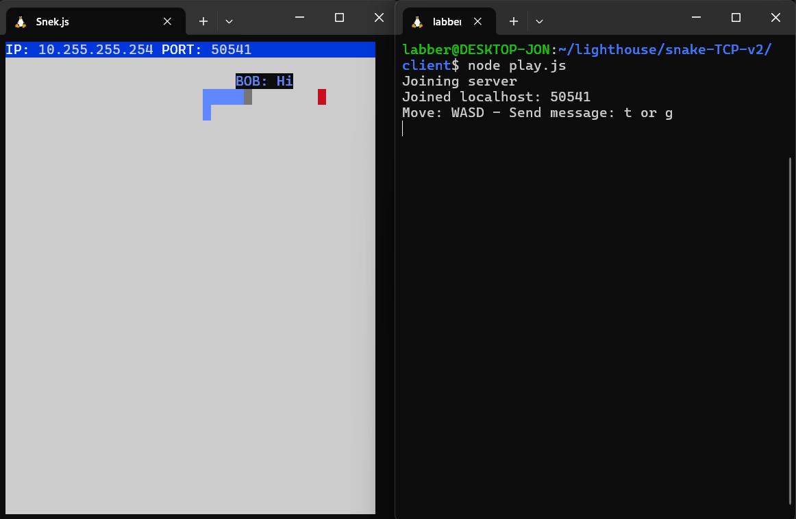

# Snake Client Project
This is a game that can be played over TCP connection or on your local machine.
WASD moves the snake and t or g send a pre-set message.

The internal folder called separated version contains the same game, but with some slightly module separated code.

## Final Product

## Getting Started

- Follow steps inside the snek server repo to run the server side
- Run the development snake client using the `node play.js` command.